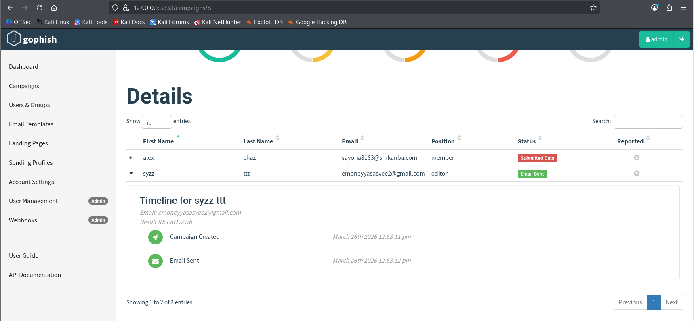

<div align="center">

```
██████╗ ██╗  ██╗██╗███████╗██╗  ██╗██╗███╗   ██╗ ██████╗ 
██╔══██╗██║  ██║██║██╔════╝██║  ██║██║████╗  ██║██╔════╝ 
██████╔╝███████║██║███████╗███████║██║██╔██╗ ██║██║  ███╗
██╔═══╝ ██╔══██║██║╚════██║██╔══██║██║██║╚██╗██║██║   ██║
██║     ██║  ██║██║███████║██║  ██║██║██║ ╚████║╚██████╔╝
╚═╝     ╚═╝  ╚═╝╚═╝╚══════╝╚═╝  ╚═╝╚═╝╚═╝  ╚═══╝ ╚═════╝ 
```

### *They clicked. They typed. They never suspected a thing.*


</div>

---

## 🕵️ The Mission

> *An email lands in your inbox. It looks real. It feels urgent. You have 24 hours before your account is gone forever.*
>
> *Would you click?*

This project simulates exactly that scenario — a full phishing attack built from scratch using **GoPhish** on **Kali Linux**, targeting a controlled test group with a spoofed Instagram security alert. Every component was handcrafted: the SMTP relay, the email template, the cloned login page, and the credential tracker.

No exploits. No malware. Just psychology — and it worked.

> ⚠️ *Conducted entirely in a controlled lab environment for academic purposes (IE3032 — Network Security, SLIIT). No real accounts or systems were targeted.*

---

## 🗺️ How It Was Built

```
 ATTACKER MACHINE  ·  Kali Linux  ·  192.168.213.128
 ══════════════════════════════════════════════════════

  [Postfix SMTP :25] ───► [GoPhish Admin 127.0.0.1:3333]
                                      │
                          ┌───────────▼────────────┐
                          │  Fake Instagram Login  │
                          │  192.168.213.128       │
                          │  "Verify your account" │
                          └───────────┬────────────┘
                                      │
              ┌───────────────────────┴──────────────────────┐
              ▼                                              ▼
       📧 alex chaz                                 📧 syzz ttt
   sayona8163@smkanba.com                     emoneyyasasvee2@gmail.com
        [member]                 VS                  [editor]
      ████████████                                  ░░░░░░░░░░
      FULLY HOOKED                                  didn't bite
```

---

## 🎭 The Lure — Campaign Anatomy

<details>
<summary><b>📧 The Email — "Your account will be suspended in 24 hours"</b></summary>
<br>

```
FROM:    instagram <security@insta.com>
SUBJECT: Unusual login activity detected
```

The email was engineered to trigger three primal responses: **fear**, **urgency**, and **trust**.

| Hook | Technique |
|---|---|
| 🌍 "Login from Moscow, Russia" | Unfamiliar location = instant panic |
| ❌ "5 failed attempts in last hour" | Implies someone is actively attacking |
| ⏱️ 24-hour countdown timer | Artificial deadline forces rash decisions |
| 🏛️ Instagram branding + official tone | Authority and legitimacy |
| 🔴 "Verify My Account Now" button | Single clear CTA — removes hesitation |

> Tracking pixel embedded — fires the moment the email is opened.

</details>

<details>
<summary><b>🌐 The Trap — Fake Instagram Login Page</b></summary>
<br>

A pixel-perfect clone of Instagram's login screen, served from `http://192.168.213.128`.

```
┌──────────────────────────────────────────────────┐
│  ⚠ SECURITY AWARENESS TRAINING BANNER (top)      │
├──────────────────────────────────────────────────┤
│                                                  │
│   [ IG ]  Instagram Login                        │
│                                                  │
│   ┌────────────────────────────────────────┐     │
│   │ 🔒 Security Verification Required      │     │
│   │ Unusual activity detected on account   │     │
│   └────────────────────────────────────────┘     │
│                                                  │
│   Username: [____________________________]       │
│   Password: [____________________________]       │
│                                                  │
│          [ Verify & Sign In ]                    │
│                                                  │
└──────────────────────────────────────────────────┘
         ↑ every keystroke goes to GoPhish
```

</details>

<details>
<summary><b>📡 The Relay — Sending Profile</b></summary>
<br>

| Field | Value |
|---|---|
| Interface | SMTP via local Postfix |
| Host | `127.0.0.1:25` |
| From | `instagram<security@insta.com>` |
| Certificate Errors | Ignored *(lab only)* |

Local Postfix acts as the mail relay — no external SMTP needed, zero footprint.

</details>

<details>
<summary><b>👥 The Targets</b></summary>
<br>

| # | Name | Email | Role | Outcome |
|---|---|---|---|---|
| 1 | alex chaz | sayona8163@smkanba.com | member | 🔴 Credentials submitted *(tester — me)* |
| 2 | syzz ttt | emoneyyasasvee2@gmail.com | editor | 🟡 Dummy account — unused |

</details>

---

## 📊 The Scoreboard

<div align="center">

```
┌──────────────┬──────────────┬──────────────┬──────────────┬──────────────┐
│  📤  SENT    │  📬  OPENED  │  🖱  CLICKED  │  🔐 CREDS    │  🚩 REPORTED │
├──────────────┼──────────────┼──────────────┼──────────────┼──────────────┤
│      2       │      1       │      1       │      1       │      0       │
│    100%      │     50%      │     50%      │    ██ 50%    │   ░░░  0%    │
└──────────────┴──────────────┴──────────────┴──────────────┴──────────────┘
```

</div>

---

## ⏱️ The Kill Chain — Minute by Minute

```
 12:58:11 pm  ●  Campaign armed
 12:58:12 pm  ●━━ Email delivered to both targets
                        │
                        ╎  · · · 1 minute 45 seconds pass · · ·
                        │
 12:59:57 pm  ◉  I (tester) open the email
              ◉  I CLICK the phishing link
                        │   browser: Firefox 140.0 / Linux x86_64
                        │
                        ╎  · · · 36 seconds pass · · ·
                        │
  1:00:33 pm  ◉  I SUBMIT CREDENTIALS  ← end-to-end confirmed
                        │   username ──► fake
                        │   password ──► fake
                        │
              ✕  syzz ttt — dummy account, not used


  total time from send → compromise:   2 min 21 sec
```

---

## 📸 Evidence

<table>
  <tr>
    <td align="center"><br><sub><b>🖥️ GoPhish & Postfix armed</b></sub></td>
    <td align="center"><br><sub><b>📧 The phishing email</b></sub></td>
  </tr>
  <tr>
    <td align="center"><br><sub><b>🌐 Fake login page</b></sub></td>
    <td align="center"><br><sub><b>📊 Live campaign dashboard</b></sub></td>
  </tr>
  <tr>
    <td align="center"><br><sub><b>🔐 Credentials captured</b></sub></td>
    <td align="center"><br><sub><b>⏱️ Full user timeline</b></sub></td>
  </tr>
</table>

---

## 🧠 What This Proves

```
╔══════════════════════════════════════════════════════════╗
║   The most exploited vulnerability in any system is      ║
║               the person using it.                       ║
╚══════════════════════════════════════════════════════════╝
```

- ⚡ Full credential harvest in **under 3 minutes** — zero technical exploits used
- 🧲 Urgency + brand impersonation = the most reliable attack combo
- ✅ End-to-end flow confirmed — from spoofed email to credential capture
- 🔑 A single MFA prompt would have made all of this useless

---

## 🛡️ Defence Playbook

| Layer | Control | Why It Matters |
|---|---|---|
| 👤 Human | Phishing awareness training | Teach people to pause before clicking |
| 👤 Human | Phishing report culture | If users report, teams can respond |
| 🔑 Account | Multi-Factor Authentication | Stolen password ≠ account access |
| 📮 Email | SPF + DKIM + DMARC | Kills spoofed sender domains |
| 🔁 Process | Regular simulated exercises | Keeps awareness from going stale |

---

## 📁 Repo Structure

```
📂 GoPhish-Phishing-Simulation/
│
├── 📂 screenshots/
│   ├── 1.png   ── GoPhish + Postfix startup
│   ├── 2.png   ── Admin panel login
│   ├── 3.png   ── Dashboard
│   ├── 4.png   ── Landing page editor
│   ├── 5-6.png ── Email template
│   ├── 7-8.png ── Sending profile
│   ├── 9.png   ── Target group
│   ├── 10.png  ── Network config
│   ├── 11.png  ── Campaign launch
│   ├── 12-13.png── Phishing email rendered
│   ├── 14-15.png── Landing page vs real Instagram
│   ├── 16.png  ── Campaign dashboard metrics
│   ├── 17.png  ── Timeline: syzz ttt
│   └── 18.png  ── Timeline: alex chaz + credentials
│
└── 📄 README.md
```

---

<div align="center">

```
[ IE3032 — Network Security ]  ·  SLIIT, Sri Lanka 🇱🇰
BSc (Hons) Information Technology — Cyber Security
```

*Built to understand attacks. Built to build better defences.*

</div>
