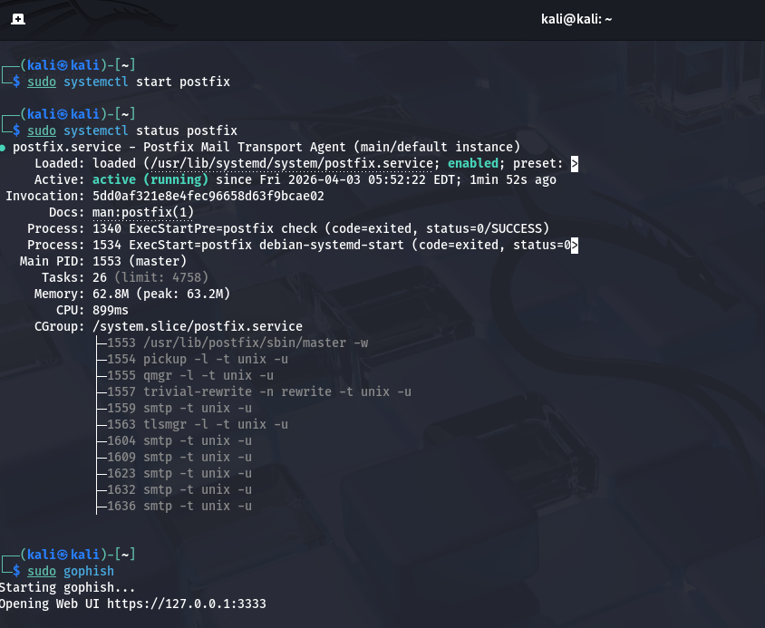
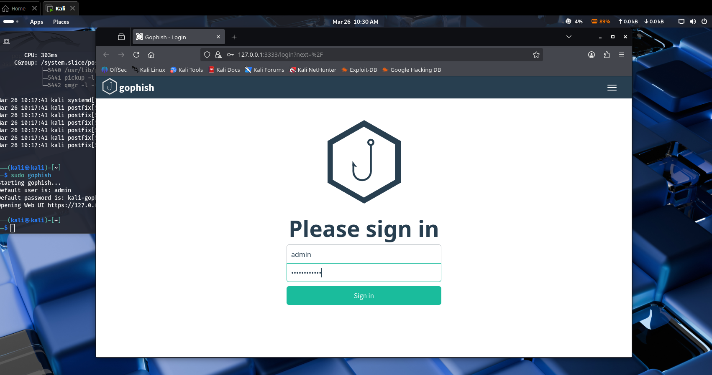
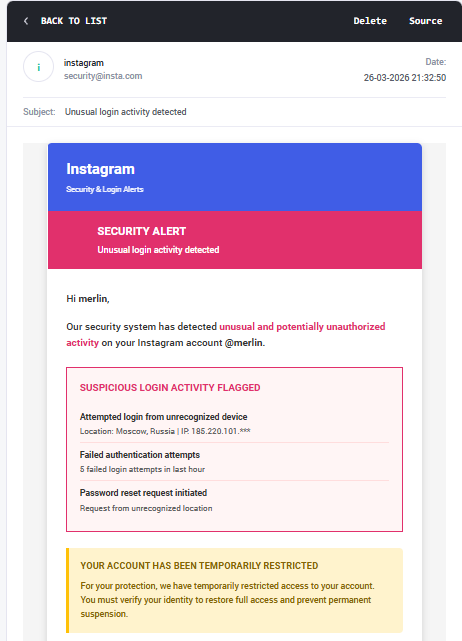
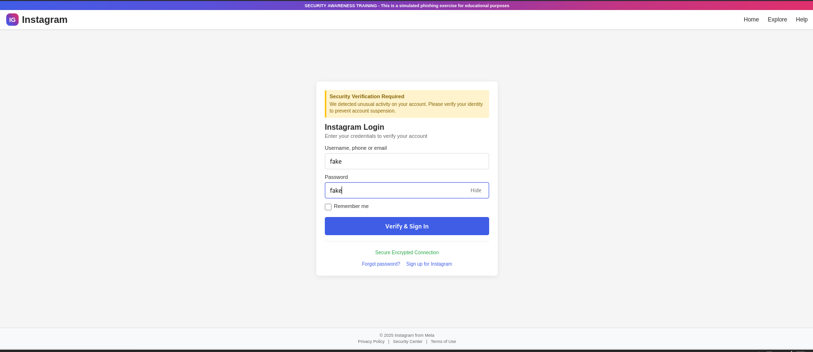
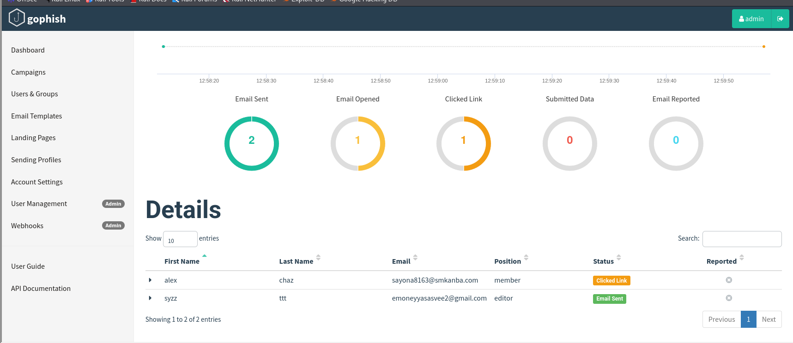
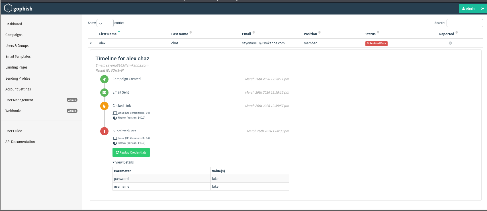

# 🎣 GoPhish Phishing Simulation — Instagram Security Alert

> Simulated phishing campaign built with GoPhish on Kali Linux for educational purposes as part of the Network Security module (IE3032) at SLIIT.

---

## 📌 Overview

This project demonstrates a full phishing attack simulation using the GoPhish framework. The campaign impersonated Instagram's security team, delivering a spoofed "Unusual Login Activity" alert to a controlled test group and tracking user interactions end-to-end.

**All activities were conducted in a controlled lab environment for academic purposes only.**

---

## 🛠️ Tools & Environment

| Component | Details |
|---|---|
| OS | Kali Linux |
| Phishing Framework | GoPhish |
| Mail Relay | Postfix (local SMTP) |
| Landing Page URL | http://192.168.213.128 |
| Admin Panel | https://127.0.0.1:3333 |

---

## 🧩 Campaign Components

### Email Template
- **Name:** Insta Security Alert
- **Sender:** `instagram<security@insta.com>`
- **Subject:** Unusual login activity detected
- **Content:** Fake suspicious login alert from Moscow, Russia with a 24-hour account suspension warning and a "Verify My Account Now" CTA button
- **Tracking image** enabled to detect opens

### Landing Page
- Cloned Instagram login page
- Displays "Security Verification Required" alert
- Captures submitted credentials
- Includes security awareness training banner at top

### Sending Profile
- Interface: SMTP via local Postfix on `127.0.0.1:25`
- From: `instagram<security@insta.com>`

### Target Group — Instagram Security

| First Name | Last Name | Email | Position |
|---|---|---|---|
| alex | chaz | sayona8163@smkanba.com | member |
| syzz | ttt | emoneyyasasvee2@gmail.com | editor |

---

### User Timelines

**alex chaz** — full kill chain completed:

| Time | Event |
|---|---|
| 12:58:11 pm | Campaign Created |
| 12:58:12 pm | Email Sent |
| 12:59:57 pm | Clicked Link (Firefox 140 / Linux x86_64) |
| 1:00:33 pm | Submitted Data (username: `fake`, password: `fake`) |

**syzz ttt** — no interaction beyond email delivery.

---

## 🔗 Attack Chain

1. Postfix SMTP started locally
2. GoPhish launched, admin panel accessible
3. Spoofed email crafted with urgency triggers
4. Fake Instagram login page deployed
5. Emails delivered to both targets
6. Target 1 opened email → tracking pixel fired
7. Target 1 clicked link → redirected to fake login page
8. Target 1 submitted credentials → captured by GoPhish
9. Target 2 — no interaction

---

## 📸 Screenshots

| | |
|---|---|
|  |  |
| Postfix + GoPhish startup | GoPhish login page |
|  |  |
| Phishing email received | Fake Instagram login page |
|  |  |
| Campaign dashboard metrics | Credential submission timeline |

---

## 💡 Key Takeaways

- Social engineering using urgency and authority cues is highly effective
- One target completed the full phishing chain in under **3 minutes**
- Zero emails were reported — highlighting a gap in reporting awareness
- Technical defences alone are insufficient without user awareness training

### Recommendations
- Regular phishing awareness training
- Enforce MFA on all accounts
- Implement SPF, DKIM, DMARC on mail domains
- Establish a clear phishing report process for users

---

## ⚠️ Disclaimer

This project was conducted entirely in a controlled lab environment for academic and educational purposes as part of the Network Security module (IE3032) at Sri Lanka Institute of Information Technology (SLIIT). No real accounts or production systems were targeted.

---

